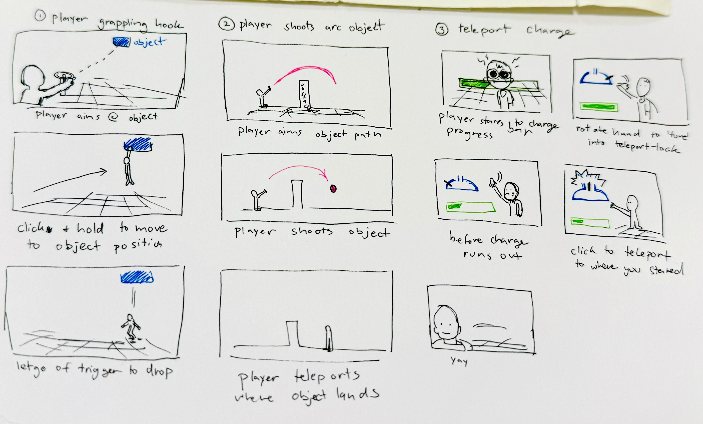

Project Proposal Template

*Teleoprtation Types*

*Nicole Nageli*

## Interaction Description

The interaction I'm exploring is teleporting/moving in VR.
The ways I'm going to implement it are 
1) The player aims with the controller to a special object acts as a grappling hook that lets the player 'pull' themselves forward in space
2) The player shoots an object and teleports wherever object lands
3) The player teleports by aiming and selecting where they want to move to.

## Testing Questions
Pre Questions:
1) How familiar are you with using VR?
* Tester 1:
* Tester 2:
* Tester 3:
* Tester 4:
* Tester 5:

2) How do you typically move in VR? (continuous movement, teleportation, jumping, flying, etc)
* Tester 1:
* Tester 2:
* Tester 3:
* Tester 4:
* Tester 5:

3) What makes moving in VR feel immersive to you?
* Tester 1:
* Tester 2:
* Tester 3:
* Tester 4:
* Tester 5:

Post Questions:
1) Which interaction felt the best to you?
* Tester 1:
* Tester 2:
* Tester 3:
* Tester 4:
* Tester 5:

2) Any points that weren't intuitive / were confusing?
* Tester 1:
* Tester 2:
* Tester 3:
* Tester 4:
* Tester 5:

3) Which movement method felt like you had the most control? Which one was the most immersive to you?
* Tester 1:
* Tester 2:
* Tester 3:
* Tester 4:
* Tester 5:

## Storyboards

